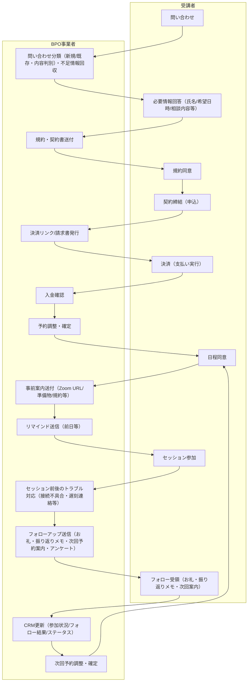
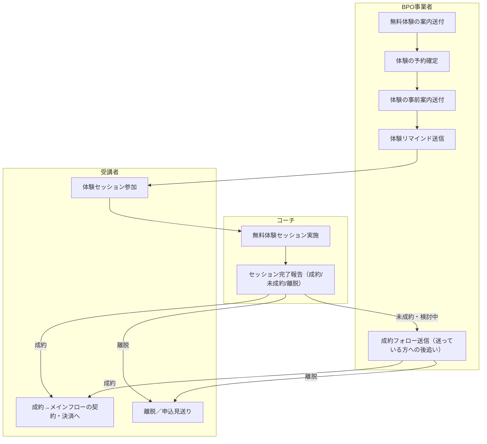
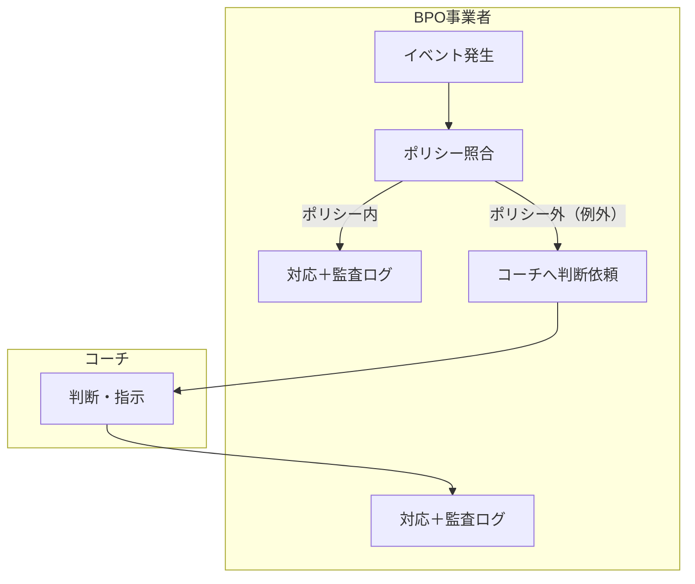
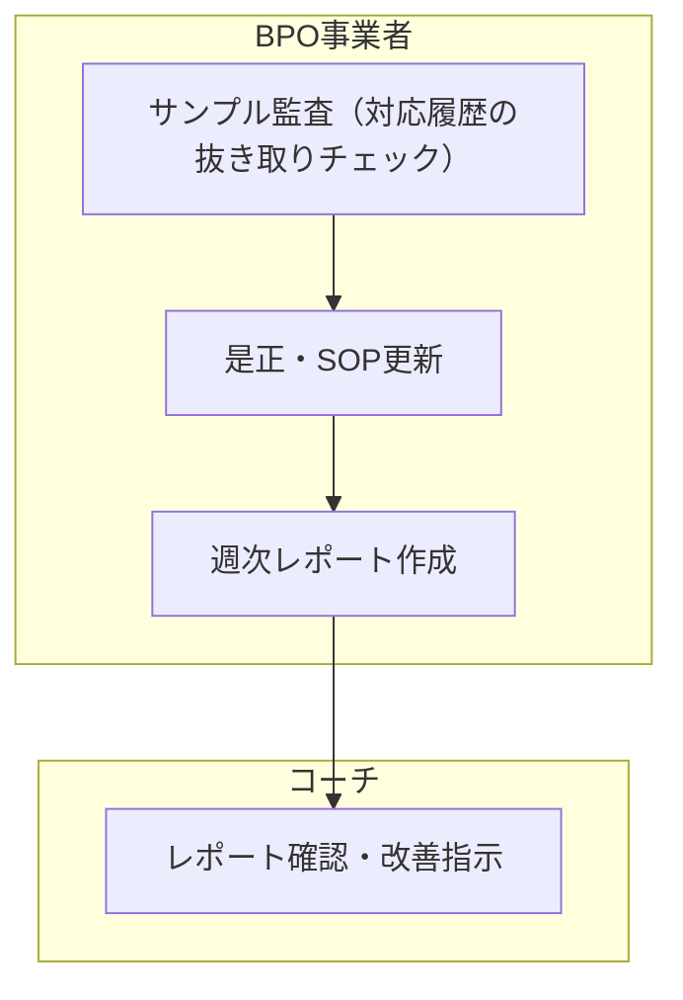

# BPO前提の業務フロー

> 親ファイル：[[事業仮説/オンライン1on1セッションBPO/index]]

> **ドメイン非依存**: このフローはコーチングに限らず、オンライン1on1セッション事業（個人コンサル、メンタリング、カウンセリング、パーソナルトレーニング、語学レッスン等）全般に適用可能。現在の記述は検証が先行しているコーチングドメインの用語（コーチ/受講者）で書かれているが、フロー構造自体はドメインに依存しない。

---

## オペレーション構築（Build）

フローより「**何を決めるか**」を揃えることが目的。コーチとBPO事業者で以下を決め、テスト・受入のうえGoLiveする。

### コーチ側で決めること

| 決めること | 例・補足 |
|------------|----------|
| **目的・KPI** | 返信速度、成約率、工数削減など、何をどこまで求めるか |
| **提供メニュー/価格/対象外** | 何をいくらで提供するか、やってよい範囲・やってはいけない領域 |
| **例外権限の設計** | 返金・割引・クレームなど、どこまでBPO事業者が判断し、どこからコーチ承認にするか |
| **返信トーン/ブランドガイド** | 受講者向けメッセージのトーン、言い回しのNGなど |
| **テンプレ承認** | 一次返信・決済・リマインド・事前案内など、各テンプレの最終OK |
| **ツール発行/権限付与** | メール・カレンダー・決済・CRM のアクセス・権限を誰にどう付与するか |
| **スケジュール・空き枠** | 事前登録 or カレンダー連携で、予約調整の前提をどう整えるか |
| **GoLive判定** | 段階拡張（入口限定→拡張）をいつ許可するか |

### BPO事業者側で設計・提案するもの（コーチ承認前提）

| 決めること | 例・補足 |
|------------|----------|
| **Runイベントの洗い出し** | 問い合わせ/未払い/リスケ/クレームなど、起こりうるイベント一覧 |
| **分岐マップ** | 意思決定が必要なポイントの列挙 |
| **ポリシー候補** | YES/NO基準・閾値（コーチが例外権限として承認） |
| **RACI/SLA** | 誰が・いつまでに・どこまでやるか |
| **テンプレ体系** | 定型＝自動運用、非定型＝承認、の切り分け |
| **ツール設計** | ラベル/タグ/ステータス/自動化ルール |
| **権限設計** | 最小権限・代理送信・二要素など |
| **監査設計** | ログ項目・保存期間・エクスポート方針 |
| **チェック設計** | 送信前チェックなど、必要最小のゲート条件 |
| **SOP** | 手順＋例外時の戻し方 |
| **テスト計画** | シナリオ・受入条件 |
| **段階GoLive設計** | 入口限定→拡張のステップ |

### 品質保証（テスト/受入）

- **テスト実施**: 疑似問い合わせ→予約→決済→当日→フォロー、および例外（未払い/返金/クレーム/規約違反）のシナリオ
- **受入判定**: 合格 or 是正（是正時はポリシー・テンプレ等を見直し）

---

## 運用（Run）

受講者の問い合わせ〜参加〜フォロー、およびリスケ/クレーム対応。BPO事業者の送信は定型はチェック＋監査ログ、非定型・高リスクは二重チェック or コーチ承認を経て送信。

### Run：メインフロー（問い合わせ→契約→セッション→フォロー）

※各「送信」は送信前チェック（定型＝監査ログで送信、例外＝二重チェック or コーチ承認→送信）を経由。  
※下図は**本申込〜本セッション**の流れのみ。無料体験を設ける場合は別節「Run：無料体験〜本申込」を参照。  
※コーチのセッション実施や例外判断・週次確認は省略し、受講者とBPO事業者のやりとりに絞ってある。

### Run：無料体験〜本申込（通例）

無料体験を設ける場合、メインフローの契約・決済の前に以下が入る。BPO事業者は体験の案内・予約・事前案内・リマインド等を本番と同様に担当。成約後はメインフローの「規約・契約書送付」以降へつなぐ。

※問い合わせ〜不足情報回収〜日程同意はメインフローと共通のため省略。体験固有のステップのみ図示。  
※「セッション完了報告」はコーチがBPO事業者に成約/未成約を伝えるトリガー。

### Run：例外処理（共通フロー）

イベントの種類によらず、例外処理は以下の共通パターンで処理する。

**トリガーとなるイベント例**

| イベント | 例 |
|----------|-----|
| 未払い継続 | 決済期限超過、入金未確認 |
| リスケ/キャンセル申し出 | 受講者からの日程変更・取消 |
| クレーム/要望 | サービス内容への不満、改善要望 |
| 返金要求 | 途中解約に伴う返金希望 |
| ノーショー（無断欠席） | 連絡なしの不参加 |
| 規約違反 | 受講者またはコーチ側の規約逸脱 |

### Run：定期業務（週次）

例外処理とは別に、定期的に実施する統制業務。

---

## 補足

- **Build**: フローより「何を決めるか」を明確にすることが目的。コーチ側・BPO事業者側で決めることを揃え、テスト・受入のうえGoLiveする。詳細は上の表を参照。
- **Run 送信ルール**: 受講者向け送信はすべて「送信前チェック → 定型なら監査ログで送信、非定型・高リスクなら二重チェック or コーチ承認 → 監査ログ」を基本に、例外はコーチ判断に戻す。
- **予約調整の前提**: コーチ側のスケジュール・空き枠が事前に登録されている（またはカレンダー連携で共有されている）必要がある。Build時に整えておく。
- **セッション前後のトラブル対応**: Zoom等の接続不具合、受講者の遅刻・欠席連絡、急なキャンセル希望など。受講者への連絡・リスケ案内・コーチへの共有をBPO事業者が担う。
- **事前案内の内容**: Zoom URL、日時確定、準備してほしいこと（話したいテーマ・質問リスト・目標の整理など）、規約・注意事項（キャンセルポリシー・守秘等）、接続テストの案内など。Buildで承認したテンプレに沿ってBPO事業者が送付。
- **フォローアップの内容**: セッション後のお礼、振り返りメモ送付、次回予約の案内、アンケート/NPS送付など。
- **継続セッション**: メインフローはCRM更新→次回予約調整→日程同意に戻るループで表現。コーチングは中長期の継続プロセスであるため。
- **セッション完了トリガー**: コーチがセッション完了をBPO事業者に伝える（完了報告）。これを受けてBPO事業者がフォロー送信・CRM更新等の後続を動かす。
- **無料体験（通例）**: 契約・決済の前に無料体験を設けるケースが多い。体験後、コーチがBPO事業者に成約/未成約を報告。未成約の場合はBPO事業者が成約フォロー（後追い）を実施。離脱の場合は受講者側の「離脱／申込見送り」。体験図はメインフローと共通の前半（問い合わせ〜日程同意）を省略し、体験固有のステップのみ図示。
- **決済まわり**: 申込〜入金を「規約同意→契約締結→決済→入金確認」に分解。契約形態や決済手段はBuildで決める。