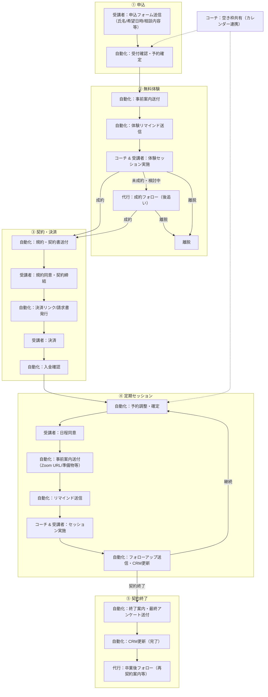
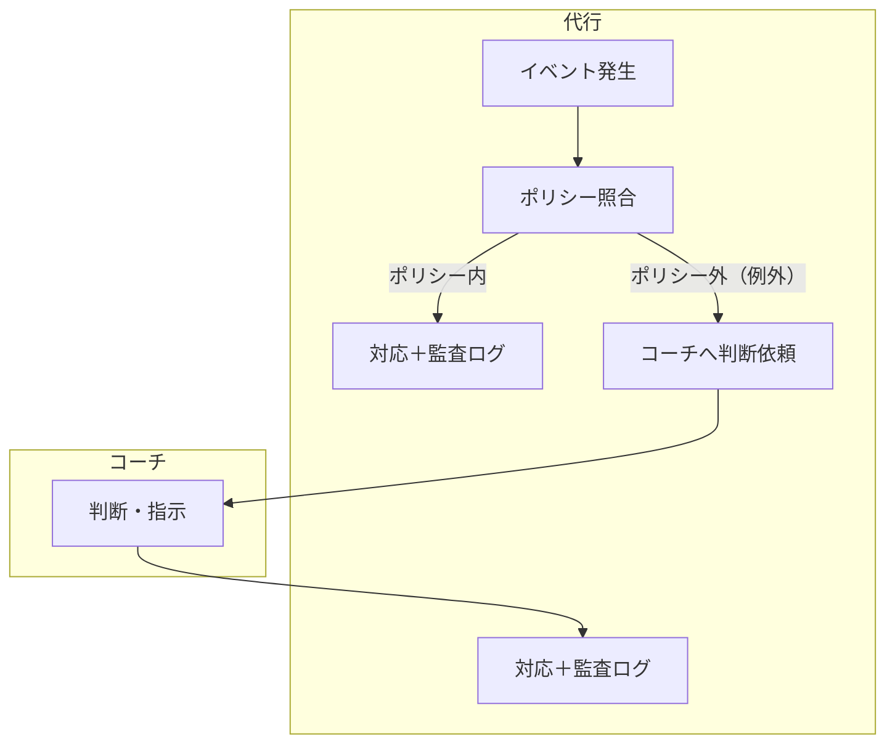
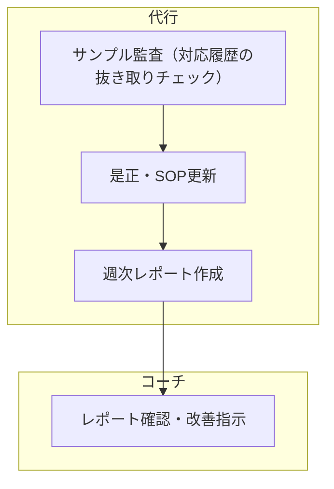

# サービス設計：業務フロー

> 親ファイル：[[00_事業概要]]

> **ドメイン非依存**: このフローはコーチングに限らず、オンライン1on1セッション事業（個人コンサル、メンタリング、カウンセリング、パーソナルトレーニング、語学レッスン等）全般に適用可能。現在の記述は検証が先行しているコーチングドメインの用語（コーチ/受講者）で書かれているが、フロー構造自体はドメインに依存しない。

---

## メインフロー（申込 → 無料体験 → 契約 → 定期セッション → 契約終了）

※各「送信」は送信前チェック（定型＝監査ログで送信、例外＝二重チェック or コーチ承認→送信）を経由。  
※コーチの本セッション実施や例外判断・週次確認は省略し、サービス側の業務に絞ってある。  
※「自動化」＝ツール連携・トリガーで自動実行、「代行」＝人の判断・個別対応が必要。

## 例外処理（共通フロー）

イベントの種類によらず、例外処理は以下の共通パターンで処理する。

**トリガーとなるイベント例**

| イベント | 例 |
|----------|-----|
| 問い合わせ（質問等） | 申込前の質問・相談、サービス内容の確認 |
| 未払い継続 | 決済期限超過、入金未確認 |
| リスケ/キャンセル申し出 | 受講者からの日程変更・取消 |
| クレーム/要望 | サービス内容への不満、改善要望 |
| 返金要求 | 途中解約に伴う返金希望 |
| 無断欠席 | 連絡なしの不参加 |

## 定期業務（週次）

例外処理とは別に、定期的に実施する統制業務。

---

## 補足

- **送信ルール**: 受講者向け送信はすべて「送信前チェック → 定型なら監査ログで送信、非定型・高リスクなら二重チェック or コーチ承認 → 監査ログ」を基本に、例外はコーチ判断に戻す。
