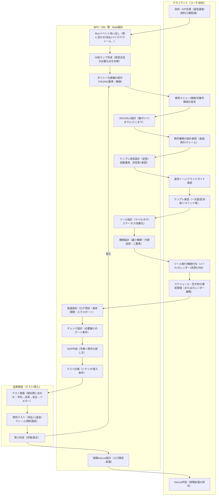
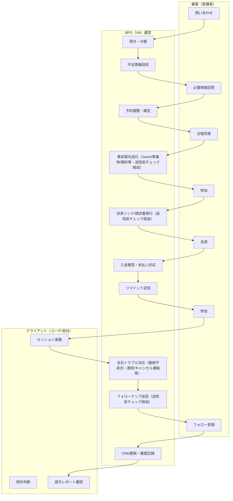
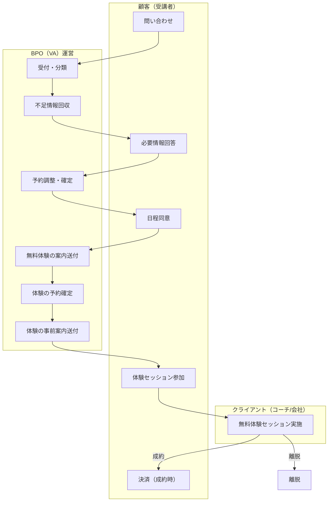
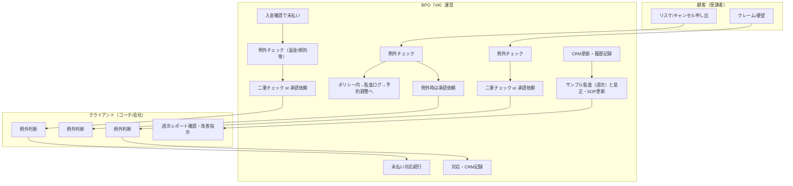

# BPO前提の業務フロー

> 親ファイル：[[事業仮説/コーチングのノンコア業務BPO/index]]
> オーガニック成長型・パートナー成長型いずれでも参照するBuild/Runの流れ。

---

## オペレーション構築（Build）

クライアント（コーチ/会社）とBPO側で目的・権限・テンプレ・ツールを合わせ、品質保証を経てGoLiveするまで。

---

## 運用（Run）

顧客（受講者）の問い合わせ〜参加〜フォロー、およびリスケ/クレーム対応。BPO側の送信は定型はチェック＋監査ログ、非定型・高リスクは二重チェック or クライアント承認を経て送信。

### Run：メインフロー（問い合わせ→参加→フォロー）

※各「送信」は送信前チェック（定型＝監査ログで送信、例外＝二重チェック or クライアント承認→送信）を経由。  
※下図は**本申込〜本セッション**の流れ。**無料体験がある場合（通例）**は、予約調整・日程同意のあとに「無料体験の案内→予約→事前案内→体験セッション実施（クライアント）→ 成約/離脱」が入り、成約時のみB4（決済）以降へ進む（下の「無料体験〜本申込」参照）。

### Run：無料体験〜本申込（通例）

無料体験を設ける場合、本申込・決済の前に以下の流れが入る。BPOは体験の案内送付・予約調整・事前案内・リマインド等を本番と同様に担当する。

※成約時は U3（決済）のあと、メインフローの B4（決済リンク/請求書発行）以降へつなぐ。

### Run：例外・統制（未払い／リスケ／クレーム／週次）

---

## 補足

- **Build**: 目的・KPI → イベント洗い出し → 分岐マップ・ポリシー候補 → クライアントのメニュー/価格/例外権限の宣言・承認 → RACI/SLA・テンプレ・ツール・権限・監査・チェック・SOP・テスト → 受入 → 段階GoLive設計 → GoLive判定。受入で是正のときはポリシー候補（B2）に戻る。
- **Run**: 顧客接触（問い合わせ/日程/決済/参加/フォロー/リスケ/クレーム）はすべて「送信前チェック → 定型なら監査ログで送信、非定型・高リスクなら二重チェック or クライアント承認 → 監査ログ」を基本に、例外はクライアント判断に戻す。週次でサンプル監査とSOP更新・レポートで改善サイクル。
- **予約調整の前提**: 予約調整を行うには、クライアント（コーチ）側のスケジュール・空き枠が事前に登録されている（またはカレンダー連携で共有されている）必要がある。Build時の「スケジュール・空き枠の事前登録」で整えておく。
- **当日トラブル対応**: セッション当日に起きうるトラブル（Zoom等の接続不具合、顧客の遅刻・欠席連絡、急なキャンセル希望など）への対応。顧客への連絡・リスケ案内・コーチへの共有などをBPOが担い、コーチはセッション実施に集中できるようにする想定。
- **事前案内**: セッション前に顧客（受講者）に送る案内。例：Zoom・MTGのURL、日時の確定内容、準備してほしいこと（話したいテーマ・質問リスト・目標の整理など）、規約や注意事項（キャンセルポリシー・守秘等）、接続テストの案内など。Buildで承認したテンプレに沿ってBPOが送付する。
- **無料体験セッション（通例）**: 本申込・決済の前に無料体験を設けるケースが多い。フロー上は、予約調整・日程同意のあと「無料体験の案内→予約確定→事前案内→体験セッション参加→無料体験セッション実施（クライアント）」を経て、成約時のみ決済（B4）以降のメインフローへ、未成約は離脱。BPOは体験の案内送付・予約調整・事前案内・リマインド等を本番と同様に担当する。
